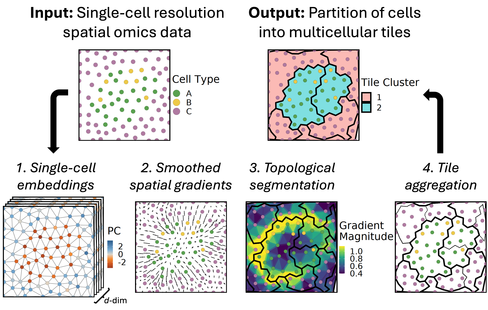

# Tessera

*Accurate tiling of spatial single-cell data with Tessera*

**Tessera** is an algorithm for segmenting single-cell resolution spatial omics data into small multicellular tiles whose edges track with natural tissue boundaries. These tiles can then be used in downstream analysis to label and define tissue regions across samples.

Check out the manuscript on [bioRxiv](https://www.biorxiv.org/content/10.1101/2025.01.17.633630v1) for additional details.



## Overview

The Tessera algorithm takes as input single cells (or pixels) with spatial coordinates and cell embeddings (or transcript counts) for each cell. The output is a segmentation of adjacent cells into tiles with a user-controlled size parameter. Boundaries between tiles align with where cell composition and gene expression change the most within the tissue. Segmentation using the Tessera algorithm has four main steps:

1. *Constructing inputs:* A triangle mesh is constructed using Delauney triangulation and pruned to eliminate long edges. If transcript counts are provided for each cell instead of embeddings, then cell embeddings are computed using principal component analysis (PCA).
2. *Gradient estimation:* Gradients are calculated at each vertex by considering the difference in cell embeddings between each cell and its neighbors in the mesh. These gradients are smoothed using anisotropic bilateral filtering, and then gradients are defined for edges and triangles in the mesh by averaging the vertices that each edge or triangle contains.
3. *Tissue segmentation using discrete Morse theory (DMT):* A scalar field is defined by taking the magnitude of the total gradient at each vertex, edge, and triangle. Then DMT-based segmentation is performed by constructing a maximum spanning forest on the triangles and a minimum spanning forest on the vertices. Separatrices that partition cells into tiles of homogeneous composition are defined by tracing paths between critical points, specifically between saddle edges and maximum triangles.
4. *Hierarchical agglomeration:* Tiles from DMT-based segmentation are merged using single-linkage agglomerative clustering to obtain tiles containing a number of cells between a user-provided minimum and maximum value. Pairs of adjacent tiles are scored according to their transcriptional similarity, compactness of shape after merging, and number of cells, in order to prioritize favorable merges in each agglomerative clustering step.

## System Requirements

### OS Requirements

`tessera` is supperted for *macOS* and *Linux*. The package has been tested on the following systems:

* macOS: Sonoma (14.6.1)
* Linux: CentOS 7 (7.9.2009)

### R Dependencies

`tessera` has been tested on R versions >= 4.3. Please consult the DESCRIPTION file for more details on required R packages, including Rcpp for R and C++ integraion.

## Installation

### Install from GitHub
Open R and run:
```R
devtools::install_github('korsunskylab/tessera')
```
This will install dependencies from CRAN, which can be slow and fails on some systems. Instead, it is recommended to install the dependencies manually using conda/mamba (see below).

### Manually install dependencies with conda/mamba (recommended)
In the command line:
```bash
mamba create -n tessera_env
mamba activate tessera_env

## If using macOS with Apple Silicon:
# conda config --env --set subdir osx-64

# Install required dependencies (~1 min)
mamba install -c conda-forge r-essentials r-rcpp r-rcpparmadillo r-bh r-devtools \
r-tidyverse r-matrix r-rlang r-r.utils r-sf r-igraph r-furrr r-future r-data.table \
r-geometry r-mclust r-rspectra r-magrittr r-harmony

# Optionally install Seurat and additional packages to run vignettes (~15 sec)
mamba install -c conda-forge r-seurat r-ggthemes r-patchwork r-viridis jupyterlab r-irkernel
```
Next, in an R console:
```R
devtools::install_github('korsunskylab/tessera', dependencies = FALSE)  # ~1 min
```

## Quick Start

### Standalone Mode

Check out `vignette("vignette_basic")` for a quick start tutorial which
demonstrates using `tessera` in standalone mode on a single sample.

The basic usage is as follows:
```R
res = GetTiles(
    X = meta_data$X,         # Vector of cell spatial coordinates
    Y = meta_data$Y,         # Vector of cell spatial coordinates
    counts = counts,         # Gene-by-cell matrix of transcript counts

    embeddings = embeddings, # (Optional) Cell-by-embedding matrix of pre-computed cell embeddings. If missing, embeddings are calculated using PCA.
    meta_data = meta_data,   # (Optional) Additional cell meta data
    meta_vars_include = meta_vars_include, # (Optional) Cell meta data to include in output

    group.by = 'sample_id',  # (Optional) Name of meta_data column that provides sample IDs. If missing, treated as a single sample.

    # Additional Tessera algorithm parameters
    prune_thresh_quantile = 0.99, prune_min_cells = 1, # Control pruning of long edges and disconnected cells
    max_npts = 50, min_npts = 5,                       # Control size of Tessera tiles
    ...                      
)
dmt = res$dmt                # Mesh data structures with results from segmentation
aggs = res$aggs              # Tiles resulting from DMT-based segmentation and agglomeration
```

### Seurat Objects (Multi-sample)
Tessera can also be applied directly to a Seurat object containing single cells with spatial coordinates.
The `GetTiles` function can use cell embeddings that have already been pre-computed (and integrated, if there are multiple samples).
By default, the output is a pair of Seurat objects: 1) a single-cell Seurat object updated with tile assignments for each cell, and 2) a Seurat object
where each entry represents an individual Tessera tile.
```R
options(future.globals.maxSize= 4*1024^3)   # For larger datasets, the memory allowance may need to be increased for parallelization
future::plan(future::multicore)             # Parallelize over multiple samples (if doing multi-sample analysis)
res = GetTiles(
    obj,        # Single-cell Seurat object
    'spatial',  # Name of dimesional reduction where x/y coordinates are stored

    embeddings = 'harmony',  # (Optional) Name of dimensional reduction where pre-computed single-cell embeddings are stored
    group.by = 'sample_id',  # (Optional) Name of meta.data column that provides sample IDs. If missing, treated as a single sample.

    # Additional Tessera algorithm parameters
    prune_thresh_quantile = 0.99, prune_min_cells = 1, # Control pruning of long edges and disconnected cells
    max_npts = 50, min_npts = 5,                       # Control size of Tessera tiles
    ...
)
obj = res$obj                # Seurat object of single-cells (with cell-to-tile mapping)
tile_obj = res$tile_obj      # Seurat object of Tessera tiles
```

## Vignettes: 
(1) Quickstart (approx. runtime: <10 sec): `vignette("vignette_basic")`

https://github.com/korsunskylab/tessera/blob/main/vignettes/vignette_basic.ipynb

(2) Walkthrough (approx. runtime: <10 sec): `vignette("vignette_stepthrough")`

https://github.com/korsunskylab/tessera/blob/main/vignettes/vignette_stepthrough.ipynb
