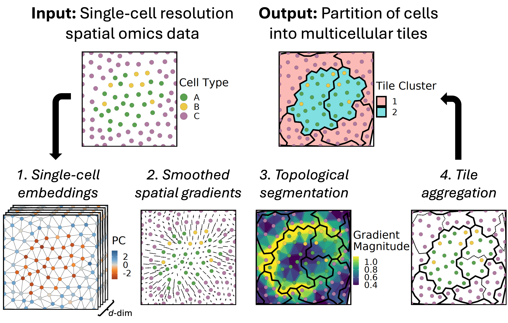

# Tessera

*Accurate tiling of spatial single-cell data with Tessera*

**Tessera** is an algorithm for segmenting single-cell resolution spatial omics data into small multicellular tiles whose edges track with natural tissue boundaries. These tiles can then be used in downstream analysis to label and define tissue regions across samples.

Check out the manuscript on [bioRxiv](https://www.biorxiv.org/content/10.1101/2025.01.17.633630v1) for additional details.



## Overview

The Tessera algorithm takes as input single cells (or pixels) with spatial coordinates and cell embeddings (or transcript counts) for each cell. The output is a segmentation of adjacent cells into tiles with a user-controlled size parameter. Boundaries between tiles align with where cell composition and gene expression change the most within the tissue. Segmentation using the Tessera algorithm has four main steps:

1. **Constructing inputs:** A triangle mesh is constructed using Delaunay triangulation and pruned to eliminate long edges. If transcript counts are provided for each cell instead of embeddings, then cell embeddings are computed using principal component analysis (PCA).
2. **Gradient estimation:** Gradients are calculated at each vertex by considering the difference in cell embeddings between each cell and its neighbours in the mesh. These gradients are smoothed using anisotropic bilateral filtering, and then gradients are defined for edges and triangles in the mesh by averaging the vertices that each edge or triangle contains.
3. **Tissue segmentation using discrete Morse theory (DMT):** A scalar field is defined by taking the magnitude of the total gradient at each vertex, edge, and triangle. Then DMT-based segmentation is performed by constructing a maximum spanning forest on the triangles and a minimum spanning forest on the vertices. Separatrices that partition cells into tiles of homogeneous composition are defined by tracing paths between critical points, specifically between saddle edges and maximum triangles.
4. **Hierarchical agglomeration:** Tiles from DMT-based segmentation are merged using single-linkage agglomerative clustering to obtain tiles containing a number of cells between a user-provided minimum and maximum value. Pairs of adjacent tiles are scored according to their transcriptional similarity, compactness of shape after merging, and number of cells, in order to prioritize favourable merges in each agglomerative clustering step.

## System Requirements

### OS Requirements

`tessera` is supported for *macOS* and *Linux*. The package has been tested on the following systems:

* macOS: Sonoma (14.6.1)
* Linux: CentOS 7 (7.9.2009)

### R Dependencies

`tessera` has been tested on R versions >= 4.3. Please consult the DESCRIPTION file for more details on required R packages, including Rcpp for R and C++ integration.

## Installation

### Install from GitHub
Open R and run:
```R
devtools::install_github('korsunskylab/tessera')
```
This will install dependencies from CRAN, which can be slow and fails on some systems. Instead, it is recommended to install the dependencies manually using conda/mamba (see below).

### Manually install dependencies with conda/mamba (recommended)
In the command line:
```bash
mamba create -n tessera_env
mamba activate tessera_env

## If using macOS with Apple Silicon:
# conda config --env --set subdir osx-64

# Install required dependencies (~1 min)
mamba install -c conda-forge r-essentials r-rcpp r-rcpparmadillo r-bh r-devtools \
r-tidyverse r-matrix r-rlang r-r.utils r-sf r-igraph r-furrr r-future r-data.table \
r-geometry r-mclust r-rspectra r-magrittr r-harmony

# Optionally install Seurat and additional packages to run vignettes (~15 sec)
mamba install -c conda-forge r-seurat r-ggthemes r-patchwork r-viridis jupyterlab r-irkernel
```
Next, in an R console:
```R
devtools::install_github('korsunskylab/tessera', dependencies = FALSE)  # ~1 min
```

## Quick Start

### Seurat Interface

The simplest way to use Tessera is through the Seurat interface:

```R
library(tessera)
library(Seurat)

result = RunTessera(
    obj        = seurat_obj,       # Seurat object with spatial coordinates
    spatial    = 'spatial',        # Name of spatial reduction
    embeddings = 'harmony',        # Name of embedding reduction (or NULL for PCA)
    max_npts   = 50,               # Maximum cells per tile
    min_npts   = 5                 # Minimum cells per tile
)

result$obj       # Input Seurat object with tile_id added to meta.data
result$tile_obj  # Tile-level Seurat object (one column per tile)
```

See `vignette("vignette_seurat")` for a complete walkthrough.

### Standalone Mode

For non-Seurat workflows, pass coordinates and counts directly:

```R
library(tessera)

result = RunTessera(
    X = coords$X,              # Cell x-coordinates
    Y = coords$Y,              # Cell y-coordinates
    counts = counts,           # Gene-by-cell sparse matrix
    max_npts = 50,             # Maximum cells per tile
    min_npts = 5               # Minimum cells per tile
)

result$aggs$meta_data   # One row per tile: id, X, Y, npts, shape, area, perimeter
result$aggs$counts      # Genes x tiles sparse count matrix
result$aggs$pcs         # Tile-level PCA embeddings
result$aggs$adj         # Tile adjacency matrix (dgCMatrix)
result$aggs$cell_ids    # Cell-to-tile mapping (ORIG_ID → tile_id)
```

### Step-by-Step Pipeline

For full control over each stage, you can call the pipeline functions directly:

```R
library(tessera)

# 1. Build cell and mesh objects
cells = make_cells(X, Y, counts)
mesh  = make_mesh(cells, prune_thresh_quantile = 0.95, prune_min_cells = 10)

# 2. Compute PCA on pruned cells
pca = do_pca(cells$counts[, mesh$pts$ORIG_ID], npcs = 30)
cells$embeddings = list(pca = pca$embeddings)

# 3. Estimate gradient field
field = compute_field(cells, mesh)

# 4. Discrete Morse Theory segmentation
mesh$morse = compute_morse(field, mesh)
dmt        = run_dmt(mesh)

# 5. Extract initial tiles from DMT
tiles_init = make_tiles(cells, mesh, dmt)

# 6. Agglomeratively merge tiles
tiles = merge_tiles(tiles_init, list(alpha = 1, max_npts = 50, min_npts = 5))
```

See `vignette("vignette_pipeline")` for a detailed walkthrough with visualisations of every stage.

## Key Parameters

| Parameter | Default | Description |
|-----------|---------|-------------|
| `max_npts` | 50 | Maximum cells per tile (main merge pass) |
| `min_npts` | 5 | Minimum cells per tile (cleanup pass) |
| `alpha` | 1 | GMM sigma multiplier for similarity scoring (0.2 = conservative, 2 = liberal) |
| `prune_thresh_quantile` | 0.95 | Quantile of edge lengths above which mesh edges are pruned |
| `prune_min_cells` | 10 | Minimum cells per connected component after pruning |
| `npcs` | 30 | Number of PCs to compute (when embeddings are not provided) |

## Vignettes

| Vignette | Description | Runtime |
|----------|-------------|---------|
| `vignette("vignette_seurat")` | Seurat integration workflow with annotated output exploration | ~10 sec |
| `vignette("vignette_pipeline")` | Step-by-step pipeline walkthrough with intermediate visualisations | ~10 sec |

Jupyter notebook versions (`.ipynb`) are also available in the `vignettes/` directory.
